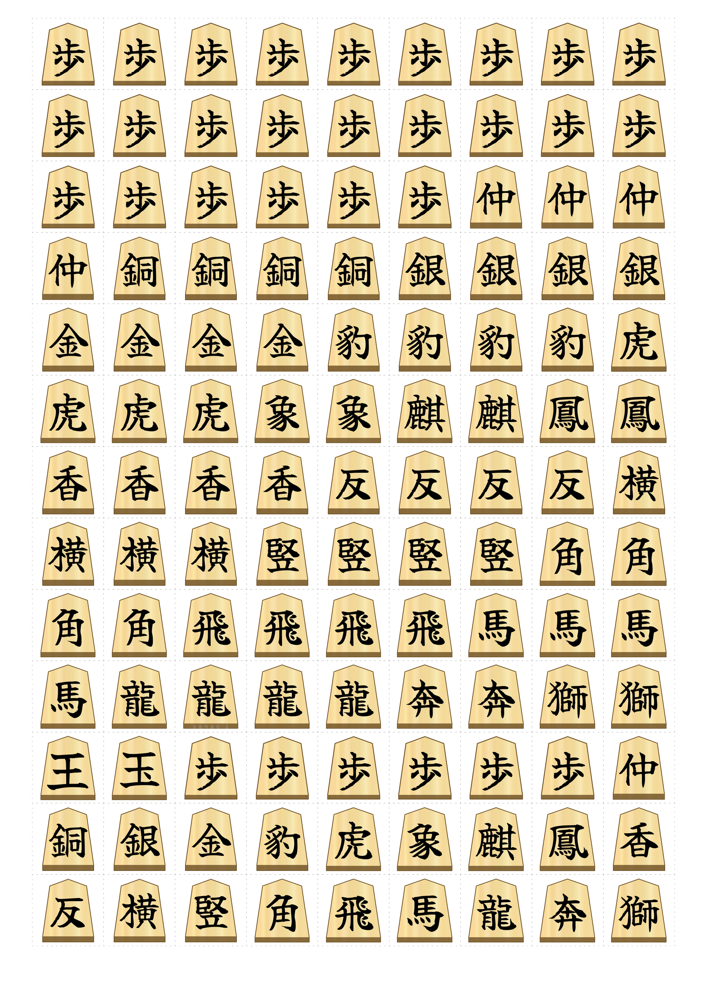
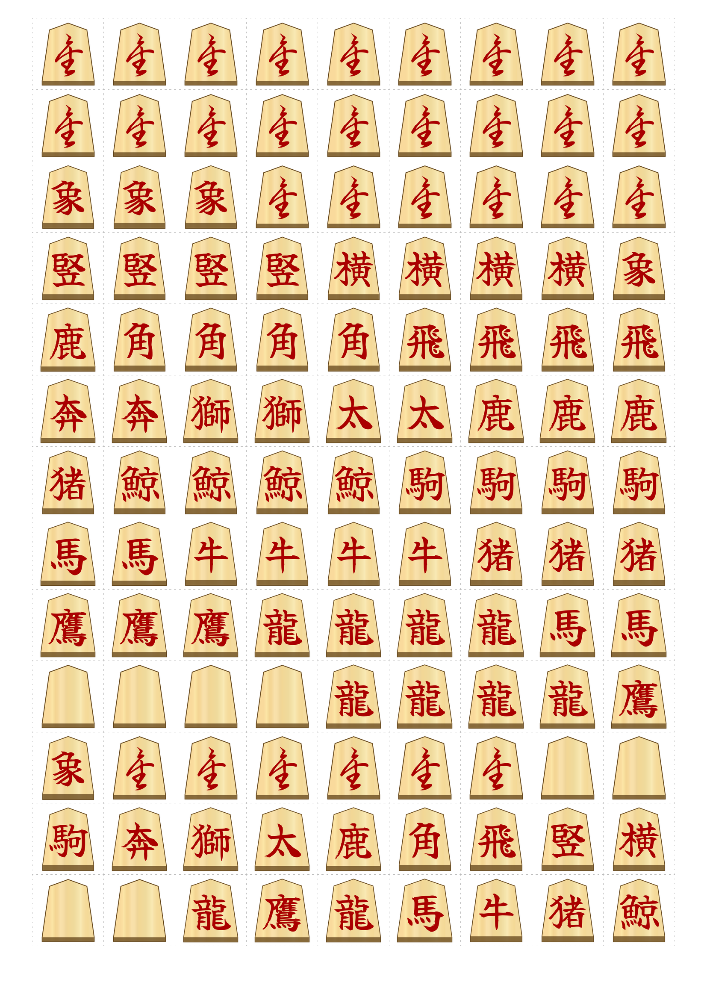
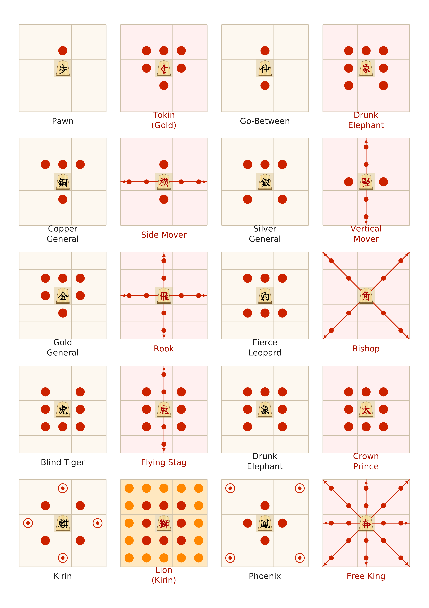
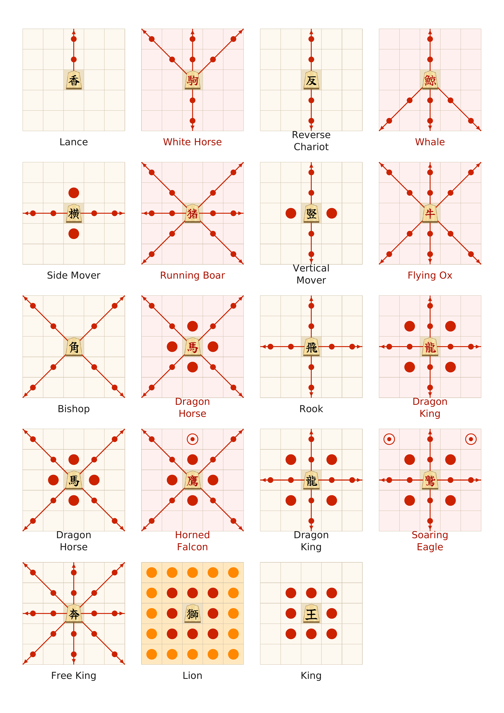
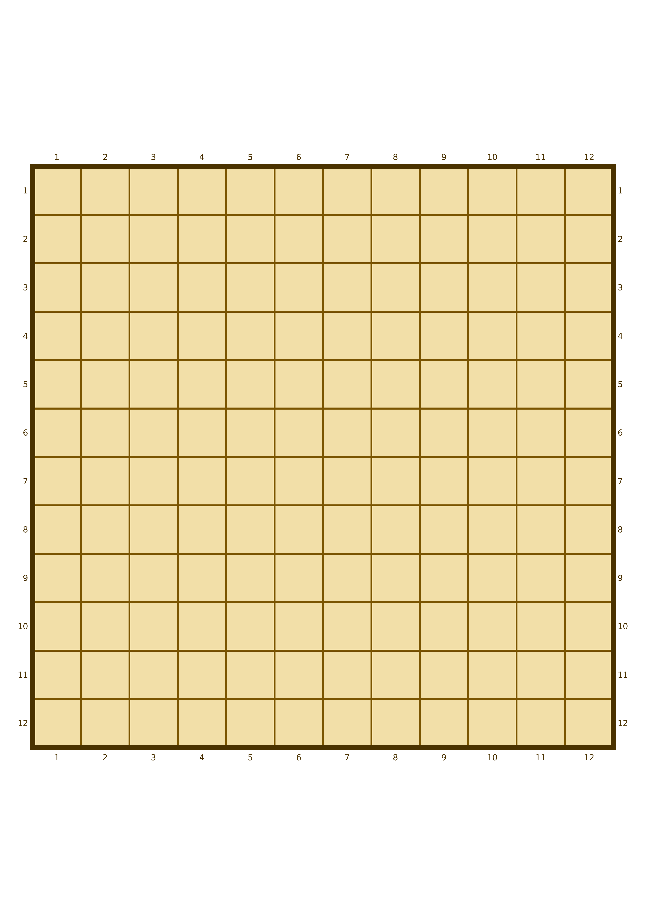

# Chu Shogi — Print-and-Play Set

A print-and-play kit for **Chu Shogi** (中将棋) — a historical Japanese strategy game
played on a 12×12 board, ancestor of modern Shogi.

---

## Print Files

| File | Description |
|------|-------------|
| `pieces/chu_shogi_board.pdf` | 12×12 board (A3) |
| `pieces/chu_shogi_pieces.pdf` | Piece sheets (2 pages: front and mirrored back) |
| `en/chu_shogi_moves.pdf` | Move diagrams for all 21 piece types |

---

## Pieces

<table><tr>
<td></td>
<td></td>
</tr><tr>
<td align="center">Front — unpromoted pieces</td>
<td align="center">Back — promoted pieces (mirrored)</td>
</tr></table>


---

## Move Diagrams

<table><tr>
<td></td>
<td></td>
</tr></table>

Other languages: [Deutsch](de/) · [Français](fr/) · [Español](es/) · [日本語](ja/) · [Русский](ru/)

---

## Board



---

## How to Assemble

1. Print [chu_shogi_board.pdf](pieces/chu_shogi_board.pdf) and [chu_shogi_pieces.pdf](pieces/chu_shogi_pieces.pdf) — 2 pages each
2. Hold page 2 (back) face-down over page 1 and align against a light source
3. Glue together and press flat until dry
4. Cut along dotted lines — each cell is exactly **2×2 cm**

Pieces without promotion (King, Lion, Free King) have a blank wooden piece on the back.

---

## Set Contents (92 pieces)

| English | 日本語 | Per player |
|---------|--------|-----------|
| Pawn | 歩兵 | 12 |
| Go-Between | 仲人 | 2 |
| Copper General | 銅将 | 2 |
| Silver General | 銀将 | 2 |
| Gold General | 金将 | 2 |
| Fierce Leopard | 猛豹 | 2 |
| Blind Tiger | 盲虎 | 2 |
| Lance | 香車 | 2 |
| Reverse Chariot | 反車 | 2 |
| Side Mover | 横行 | 2 |
| Vertical Mover | 竪行 | 2 |
| Bishop | 角行 | 2 |
| Rook | 飛車 | 2 |
| Dragon Horse | 龍馬 | 2 |
| Dragon King | 龍王 | 2 |
| Drunk Elephant | 酔象 | 1 |
| Kirin | 麒麟 | 1 |
| Phoenix | 鳳凰 | 1 |
| Free King | 奔王 | 1 |
| Lion | 獅子 | 1 |
| King | 王将 / 玉将 | 1 |

---

## Rules (quick reference)

- **12×12 board**, 46 pieces per player, 21 piece types
- Captured pieces are **removed** from the game (not returned to hand)
- Promotion zone — **4 rows** at the opponent's end
- Goal — **capture the King** (or both King and Crown Prince)
- Key feature — **Lion** (獅子): two moves per turn, can capture two pieces

---

## Reproduce

```bash
pip install reportlab cairosvg Pillow python-docx

# Font (Ubuntu/Debian):
apt install fonts-ipafont-gothic

# SVG pieces:
git clone --depth=1 https://github.com/WandererXII/lishogi.git lishogi

# Generate:
python3 build_board.py               # board → pieces/
python3 build_pieces.py              # piece sheets → pieces/
python3 build_moves.py en            # move diagrams — English → en/
python3 build_moves.py de            # German → de/
python3 build_moves.py fr            # French → fr/
python3 build_moves.py es            # Spanish → es/
python3 build_moves.py ja            # Japanese → ja/
python3 build_moves.py ru            # Russian → ru/
python3 build_rules.py               # rules (DOCX) → ru/
```

---

## License

Code and generated files are licensed under the [MIT License](LICENSE).

Piece graphics — **ryoko_1kanji** set from
[lishogi / shogiground](https://github.com/WandererXII/shogiground), license CC BY-SA.
